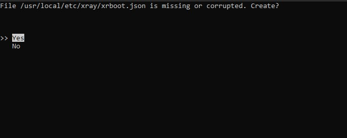

# xray-tools

Мои личные инструменты для обслуживания xray-core  

# Начальная настройка сервера: _xray-bootstrap.py_

## Возможности
- Общее обслуживание существующих конфигов: JSON парсится, изменяется и сохраняется на диск без создания новой таблицы, поэтому **невалидные JSON-конфигурации, скорее всего, останутся невалидными после работы скрипта**;  
- Бесследность: скрипт, если явно не указано иное, хранит собственную конфигурацию — `xrboot.json` — и использует отдельный демон-сервис `xray@xrboot.service`, так что при желании от его настроек можно легко избавиться;  
- Генерирует дампы URL-ов в формате CSV;  
- Интуитивно понятен в использовании, вроде бы...  

## Требования
- [Xray-core](https://github.com/XTLS/Xray-core);  
- [cURL](https://curl.se/);  
- [Python3](https://www.python.org/);  

## Использование

### 1. Установка xray-core

В большинстве случаев достаточно этой команды, но рекомендую также ознакомиться с [документацией](https://github.com/XTLS/Xray-install) и выбрать оптимальный вариант для вас  

```bash
bash -c "$(curl -L https://github.com/XTLS/Xray-install/raw/main/install-release.sh)" @ install
```

### 2. Запуск скрипта

```bash
python3 <(curl https://codeberg.org/untodesu/xrtools/raw/branch/main/scripts/xray-bootstrap.py)
```

### 3. Навигация через curses-интерфейс

Далее откроется текстовый интерфейс (TUI) на базе curses, который проведёт вас через настройку входящих подключений VLESS (на момент написания других пресетов нет)  



### 4. ?????

### 5. PROFIT!
